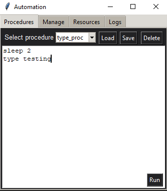

# Automation Toolkit

## Description
This Python project provides a GUI-based automation toolkit, facilitating easy management and execution of procedures, resources, and events. It's built using `tkinter` for the GUI components and structured with separate manager classes for procedures, events, and resources.

**Note:** This project is currently in development and not fully completed. Features and documentation may be subject to change.

## Features
- GUI for managing and running procedures.
- Load, save, and delete procedures from a user-friendly interface.
- Manage resources and events with ease.
- Modular design for easy expansion and maintenance.

## Structure
- main.py: The entry point of the application. Initializes and opens the main menu.
- menu.py: Contains the Menu class, responsible for creating and managing the GUI components.
- proceduremanager.py, eventmanager.py, resourcemanager.py: These modules manage procedures, events, and resources respectively.
- util.py: Contains utility functions, like folder creation.

## Requirements
- Python 3.x
- tkinter (usually comes pre-installed with Python)

## Installation
To install this project, clone the repo and launch main.py:
```bash
git clone https://github.com/alexjohnyoung/automation-toolkit.git
